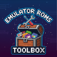

# Double Checker

*Finds and removes similar duplicates and their associated images.*

Double Checker is a browser-based utility designed to help you clean up and manage your game/ROM collections. It intelligently finds files that are similar but not identical, such as different regional versions, revisions, or formats of the same game. It then presents these "duplicate groups" to you, allowing you to select the version you want to keep and delete the rest.

## How It Works

Unlike simple duplicate finders that only check for identical files, Double Checker uses a smart algorithm to determine similarity. It normalizes filenames by removing common variations before comparison, such as:

-   Region tags (e.g., `(USA)`, `(Europe)`)
-   Disc or part numbers (e.g., `(Disc 1)`, `(Part 2)`)
-   Miscellaneous tags (e.g., `[b1]`, `[h1]`)

For example, it would recognize `MyGame (USA).zip`, `MyGame (Europe) (Rev 1).zip`, and `MyGame.zip` as being part of the same duplicate group.

## Features

-   **Intelligent Duplicate Detection:** Finds similar files, not just identical ones.
-   **Associated Image Deletion:** When a file is deleted, its corresponding artwork (e.g., `.png`, `.jpg`) in the image folder is also removed.
-   **Visual Interface:** Displays duplicate groups clearly, with image previews to help you decide.
-   **Safe & Local:** Runs entirely in your web browser. Your files are never uploaded and are accessed directly from your local machine using the File System Access API.
-   **User Control:** You have the final say. Files are only deleted when you explicitly choose which ones to remove.

## How to Use

1.  **Open the Tool:** Open the `index.html` file in a modern web browser that supports the File System Access API (like Google Chrome or Microsoft Edge)
     [**Try the Tool here!**](https://vectrex71.github.io/Double-Checker/)
2.  **Select Folders:**
    -   Click **Select ROM Folder** and choose the directory containing your game files.
    -   Click **Select Image Folder** and choose the directory where your game artwork is stored.
    -   Your browser will ask for permission to view and modify these folders. You must grant permission for the tool to work.
3.  **Start Scan:** Once both folders are selected, click the **Find Duplicates** button. The tool will scan your ROM folder for potential duplicates.
4.  **Review Results:**
    -   The tool will display groups of similar files.
    -   For each group, select the radio button next to the single file you wish to **keep**.
    -   The file marked in green will be kept. All other files in that group will be marked for deletion.
5.  **Delete Files:** After reviewing all groups, click the **Delete Marked Files** button. The tool will permanently delete the redundant files and their associated images from your folders.

**WARNING:** The deletion process is permanent. Please double-check your selections before confirming the deletion.

## Support the Project

If you find this tool useful, please consider supporting its development!

